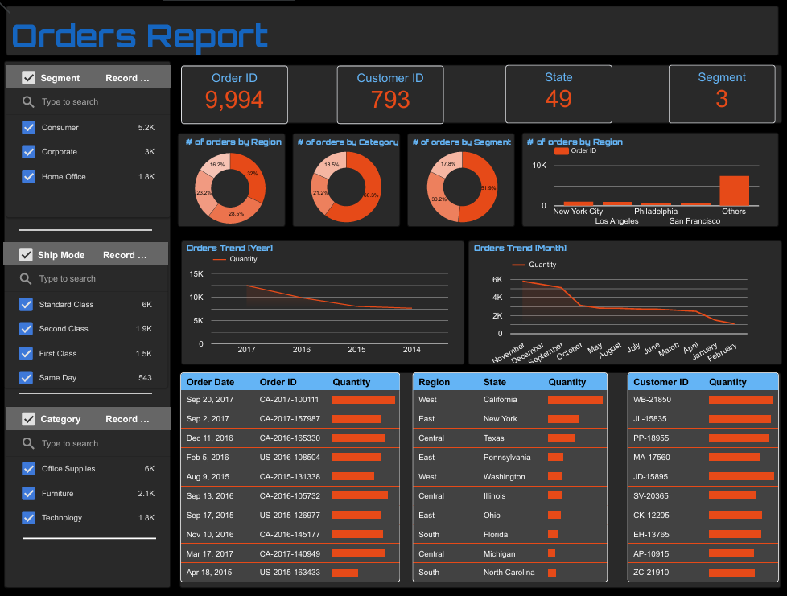

# Orders Report Dashboard

## Project Overview

This project presents an interactive Orders Report Dashboard developed using Looker Studio. The dashboard provides insights into order distribution, customer behavior, regional performance, shipping methods, and sales trends through interactive visualizations and filters.

## Key Insights

- Total Orders: 9,994
- Total Customers: 793
- Total States: 49
- Total Segments: 3
- Office Supplies recorded the highest number of orders.
- Consumer segment contributed the largest share of orders.
- Standard Class was the most frequently used shipping mode.
- Order volume was highest during November and December.
- New York City and Los Angeles were among the leading cities by order count.
  
## Dashboard Preview

## Business Questions Answered

- Which regions generate the highest number of orders?
- Which product categories receive the most orders?
- How are orders distributed across customer segments?
- What are the monthly and yearly order trends?
- Which shipping modes are most commonly used?
- Which customers contribute the highest order volumes?
- Which states and cities generate the most orders?

## Skills Demonstrated

- Data Cleaning
- Data Analysis
- Dashboard Design
- Data Visualization
- Business Intelligence
- KPI Reporting
- Trend Analysis
- Customer Analysis
- Interactive Dashboard Development

## Tools Used

- Looker Studio
- Microsoft Excel
- Data Visualization Techniques

## Key Metrics

- Total Orders: 9,994
- Total Customers: 793
- States Covered: 49
- Customer Segments: 3
- Product Categories: 3
- Shipping Modes: 4

## Live Dashboard

🔗 **View Interactive Dashboard**

[Click Here to View Dashboard]https://datastudio.google.com/reporting/2b625039-bf8a-484b-86cd-827282ea945e

## Dataset

The dataset contains order transaction information including:

- Order ID
- Customer ID
- Order Date
- Region
- State
- City
- Category
- Segment
- Ship Mode
- Quantity

## Author

Nithujana Mahenthiranathan
